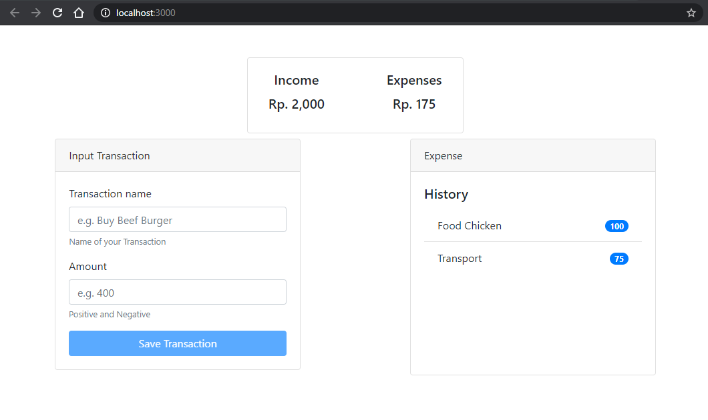

This project was bootstrapped with [Create React App](https://github.com/facebook/create-react-app).

## Author

<a href="https://www.ekaprasetia.com/">
  
</a>

<a href="https://twitter.com/dannyeka">
  
</a>

## About Expense Tracker

Simple to track your expense that compared with your income, you can insert positif and negative (income) expense

## Screenshot



## Usage

```
git clone https://github.com/ekaone/Expense-Tracker.git
cd Expense-Tracker
npm install
npm start
```
